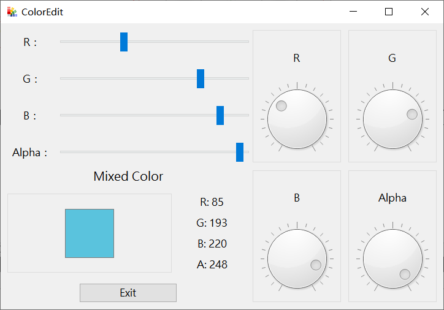

# Qt Demos for book《Qt5.9 c++开发指南》

> 学习Qt过程中做的一些小demo，用书是Qt5.9 c++开发指南》.
---
## 2-1_HelloWorld
Hello World.


+ Label
+ Push Button
+ SIGNAL & SLOT

## 2-2_Widgets
Simple editor.


+ Check Box
+ Radio Button
+ Layout
+ Text Edit: set font italic, set font bold, set font underline, set palette(to set textedit font color)
+ SIGNAL & SLOT
+ QObject::connect: `connect(const QObject *sender, const char *signal, const QObject *receiver, const char *method, Qt::ConnectionType type = Qt::AutoConnection)`

## 2-4_TextEditor
Text editor.


+  **Design Mode: 代码化+可视化(code+ui)**
+  Set icon
+  ToorBar
+  statusBar
+  SIGNAL & SLOT
+  Action
+  qDebug()
+  ProgressBar
+  SpinBox
+  Text Edit: set font, set font italic, set font bold, set font underline, set font pointsize, clear...
+  QDir
+  QFileDialog
+  QMessageBox
+  QFile + QIODevice & QFile + QTextStream to read and write text file

## 4-3_SpinBox_Sample
Simple price caculator.


+ SpinBox(prefix, suffix)
+ Group Box
+ lineEdit
+ `QString::number(), QString.setNum()`...

## 4-4_QSliderSample
Simple Color Mixer


+ Slider
+ Dial
+ QColor: `QColor color; color.setRgb(r, g, b, a);`
+ QPalette:
  ```Qt
    QPalette p = ui->textEdit->palette();
    p.setColor(QPalette::Base, color);
    ui->textEdit->setPalette(p);
  ```

## 4-5_Time
Use of time Classes.


+ QTime
  ```Qt
  QTime t;
  t.start();
  //do something
  t.elapsed();//do something time in miliseconds.
  ```
+ QDateTime
  ```Qt
  QDateTime datetime = QDateTime::currentDateTime();
  QString time_str = datetime.toString("yyyy-MM-dd hh:mm:ss"));
  QDateTime datetime = QDateTime::fromString(time_str,"yyyy-MM-dd hh:mm:ss");
  ```
+ QTimer
  ```Qt
  QTimer* timer_1 = new QTimer(this);
  timer_1->stop();
  timer_1->setInterval(1000);
  connect(timer_1, SIGNAL(timeout()), this, SLOT(on_timer_1_timeout()));
  
  void on_on_timer_1_timeout()
  {
      //do something every timer interval
  }
  ```
+ Date/Time Edit

## 4-7_ItemWidget
Use of item-based or model-view Widgets.


+ Tool Box(Container)
+ Tab Widget(Container)
+ QListWidgetItem
+ QListWidget(item based)
+ QTableWidgetItem
+ QTableWidget(item based), how to fill the table with items
+ QStandardItemModel
+ QTableView(Model-View), setModel
+ QListWidget/QTableWidget: append, insert, delete(QTableWidget逆序遍历remove), clear, selectAll, selectNone, selectInvert, autoResize
+ How to custom right-click Menu: 如何自定义右键快捷菜单
+ Tool Button(How to bind action)
+ Button setStyleSheet
+ Read CSV(std ifstream, getline() split string)
+ Container:QList, QStringList
+ QDir:
  ```Qt
  //get dir_path files.
  QDir dir;
  dir.setPath(path);
  return dir.entryList(QDir::Files);
  ```
